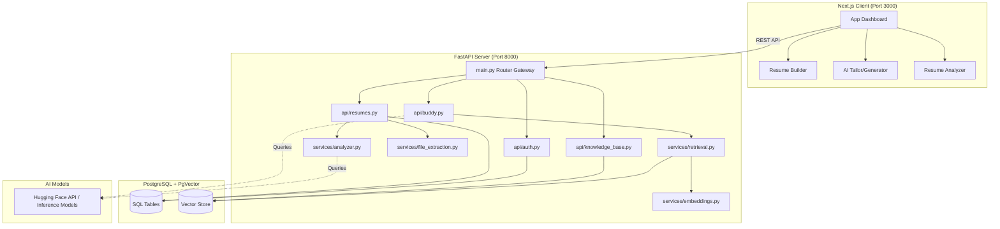

# ResumeBuddy: Architecture & Component Walkthrough

Welcome to the architectural overview of **ResumeBuddy** (also referenced as **ResumeX**). This document breaks down the entire codebase section-by-section, showing exactly how requests flow, where databases connect, how the AI models rank matches, and how the interactive frontend interfaces are structured.

---

## 1. High-Level System Architecture

ResumeBuddy is a multi-tier web application built using **FastAPI** (Python) for the backend and **Next.js** (TypeScript/React) for the frontend.



---

## 2. Backend Breakdown (FastAPI)

The backend code is organized inside `backend/app/` according to standard FastAPI clean architecture.

### A. Initialization & Setup
*   **[backend/main.py](file:///Users/amitpanwar/Desktop/mlproject-main/ResumeBuddy/backend/main.py)**:
    The entry point of the server. Instantiates the FastAPI application, configures CORS middleware (allowing cross-origin requests from the React client on port 3000), and registers API endpoints under prefix `/api`.
*   **[backend/app/database.py](file:///Users/amitpanwar/Desktop/mlproject-main/ResumeBuddy/backend/app/database.py)**:
    Configures SQLAlchemy. Establishes the engine connection pool to PostgreSQL, creates session makers (`SessionLocal`), and defines the declarative base (`Base`) from which all SQLAlchemy database tables inherit.
*   **[backend/app/config.py](file:///Users/amitpanwar/Desktop/mlproject-main/ResumeBuddy/backend/app/config.py)**:
    Manages configuration variables such as the PostgreSQL connection string and Hugging Face API tokens by reading them from system environments or the `.env` file.
*   **[backend/app/dependencies.py](file:///Users/amitpanwar/Desktop/mlproject-main/ResumeBuddy/backend/app/dependencies.py)**:
    Houses FastAPI dependencies, primarily:
    *   `get_db()`: Yields active database sessions and ensures they are safely closed after a request finishes.
    *   `get_current_user()`: Validates incoming HTTP Bearer tokens (JWT), decodes the user ID, queries the database, and injects the current authenticated user into active routes.

### B. Database Models (`app/models/`)
*   **[user.py](file:///Users/amitpanwar/Desktop/mlproject-main/ResumeBuddy/backend/app/models/user.py)**:
    Defines the `User` table (id, email, hashed_password, created_at) representing the candidate accounts.
*   **[resume.py](file:///Users/amitpanwar/Desktop/mlproject-main/ResumeBuddy/backend/app/models/resume.py)**:
    Defines the `Resume` table (id, user_id, title, raw_text, structured_data, created_at). Structured data holds resume blocks parsed from JSON schemas.
*   **[knowledge_base.py](file:///Users/amitpanwar/Desktop/mlproject-main/ResumeBuddy/backend/app/models/knowledge_base.py)**:
    Defines schemas for RAG (Retrieval-Augmented Generation). Uses **pgvector** to store 384-dimensional dense vectors alongside document chunks, representing personal projects, resume history, and technical domains.

### C. API Endpoints (`app/api/`)
*   **[auth.py](file:///Users/amitpanwar/Desktop/mlproject-main/ResumeBuddy/backend/app/api/auth.py)**:
    Responsible for candidate authentication.
    *   `/register`: Hashes passwords using `bcrypt` and stores user records in the database.
    *   `/token`: Validates passwords, signs JSON Web Tokens (JWT) containing expiration times, and returns access tokens.
*   **[resumes.py](file:///Users/amitpanwar/Desktop/mlproject-main/ResumeBuddy/backend/app/api/resumes.py)**:
    Handles document storage and analytics.
    *   `POST /resumes/`: Uploads a raw document, triggers text extraction, and writes the resume record.
    *   `POST /resumes/analyze`: Receives a resume file (PDF/Docx) and optional Job Description. Extracts text, runs scoring audits, generates suggestions, and returns the full JSON report.
*   **[buddy.py](file:///Users/amitpanwar/Desktop/mlproject-main/ResumeBuddy/backend/app/api/buddy.py)**:
    Core engine for resume tailoring. Pastes a job description and uses RAG models to select matches and draft professional bullet summaries.
*   **[knowledge_base.py](file:///Users/amitpanwar/Desktop/mlproject-main/ResumeBuddy/backend/app/api/knowledge_base.py)**:
    Exposes endpoints to index chunks, compute embeddings, and search matching context from user assets.

### D. Business Logic Services (`app/services/`)
*   **[file_extraction.py](file:///Users/amitpanwar/Desktop/mlproject-main/ResumeBuddy/backend/app/services/file_extraction.py)**:
    Handles text parsing:
    *   For **PDFs**, it uses `PyMuPDF` (`fitz`) to iterate through pages and extract characters.
    *   For **DOCX** files, it uses `python-docx` to read paragraphs.
*   **[analyzer.py](file:///Users/amitpanwar/Desktop/mlproject-main/ResumeBuddy/backend/app/services/analyzer.py)**:
    Analyzes formatting, structure, and text quality:
    *   *Section Detection*: Matches headers against case-insensitive regex lists to verify standard sections exist.
    *   *Spelling & Grammar*: Checks words against a local dictionary of common typos (`COMMON_TYPOS`), returning context snippets.
    *   *Bullet Audits*: Traces the main body text, skipping structural areas (Education, Skills, Certifications) via `remove_sections()`. Audits remaining bullets for metrics, past-tense action verbs, and impact connectors.
    *   *Duplication Checker*: Triggers alerts if action verbs are repeated 3+ times.
    *   *Keyword Intersection*: Calibrates keyword scores by matching tokens from job descriptions against a calibrated threshold.
    *   *Readability Formula*: Approximates syllables to output a Flesch Reading Ease rating.
*   **[embeddings.py](file:///Users/amitpanwar/Desktop/mlproject-main/ResumeBuddy/backend/app/services/embeddings.py)**:
    Queries or runs local Hugging Face `SentenceTransformers` to convert text chunks into vector embeddings.
*   **[retrieval.py](file:///Users/amitpanwar/Desktop/mlproject-main/ResumeBuddy/backend/app/services/retrieval.py)**:
    Combines dense semantic searches (cosine similarity on pgvector) and lexical matches (BM25) to return RAG results.

---

## 3. Frontend Breakdown (Next.js)

Built using **Vite / Next.js**, the client codebase leverages React hooks and Vanilla CSS for high-performance visuals.

### A. Pages & Routing (`frontend/src/app/`)
*   **[page.tsx](file:///Users/amitpanwar/Desktop/mlproject-main/ResumeBuddy/frontend/src/app/page.tsx)** (Landing Page):
    The entry landing page. Provides standard hero typography, CSS-animated grid items, features lists, and links directing candidates to log in or enter the dashboard.
*   **[dashboard/page.tsx](file:///Users/amitpanwar/Desktop/mlproject-main/ResumeBuddy/frontend/src/app/dashboard/page.tsx)** (Main Hub):
    Acts as the navigation central. Features a premium 3-card layout that splits the product paths:
    *   **Resume Builder** (Blue theme)
    *   **Tailored Generator** (Green theme)
    *   **Resume Analyzer** (Purple theme)
*   **[analyzer/page.tsx](file:///Users/amitpanwar/Desktop/mlproject-main/ResumeBuddy/frontend/src/app/analyzer/page.tsx)** (Dashboard & Reports):
    The interactive dashboard we developed:
    *   *Circular Progress Ring*: Uses SVG stroke-dasharray properties to animate the ATS score indicator.
    *   *File Upload Container*: Standard drag-and-drop target reading files via `FormData`.
    *   *Score Breakdown List*: Displays interactive progress bars for Structure, Language Quality, Impact, and Contact Quality.
    *   *Missing Keywords Checklist*: Renders missing skills dynamically as card checklists complete with category badges and copy-paste rephrasing tips.
    *   *Action Verb Bank*: Interactive tags that copy to clipboard on click for rapid resume tailoring.
*   **[builder/[id]/page.tsx](file:///Users/amitpanwar/Desktop/mlproject-main/ResumeBuddy/frontend/src/app/builder/%5Bid%5D/page.tsx)** (Resume Builder):
    A drag-and-drop interface containing interactive forms for updating details, sections, and compiling downloadable resumes.

---

## 4. Key End-to-End Data Flows

### Data Flow A: Resume Upload & Analysis
```
1. Next.js (page.tsx) captures file -> Appends to FormData -> Calls POST /api/resumes/analyze
2. FastAPI (resumes.py) receives request -> Calls file_extraction.py
3. PyMuPDF extracts raw text string -> Passes text to analyzer.py
4. analyzer.py runs audits:
   - Removes Education, Skills, and Certifications from text
   - Matches remaining bullets against verb lists and metric regexes
   - Computes Flesch Reading Ease and keyword intersections
   - Generates contextual missing keyword placement tips
5. Endpoint packages data -> Returns JSON AnalysisReport
6. React page receives JSON -> Animates circular charts and populates checklist cards
```

### Data Flow B: RAG Tailoring (Job Description Matching)
```
1. Next.js (buddy/page.tsx) passes Job Description -> Calls POST /api/buddy/tailor
2. FastAPI (buddy.py) converts JD to text embedding via embeddings.py
3. Performs hybrid retrieval on Postgres:
   - Cosine Similarity searches context vectors
   - BM25 searches word matches
4. Selects the top-matching projects or work bullet summaries
5. Packages context + prompt -> Queries LLM (e.g. Qwen / HF Serverless API)
6. Returns tailored project descriptions matching the job details
```

---

This elegant modular system ensures that parsing, database vector lookups, local heuristics, and modern responsive visual components are decoupled, robust, and highly maintainable!
