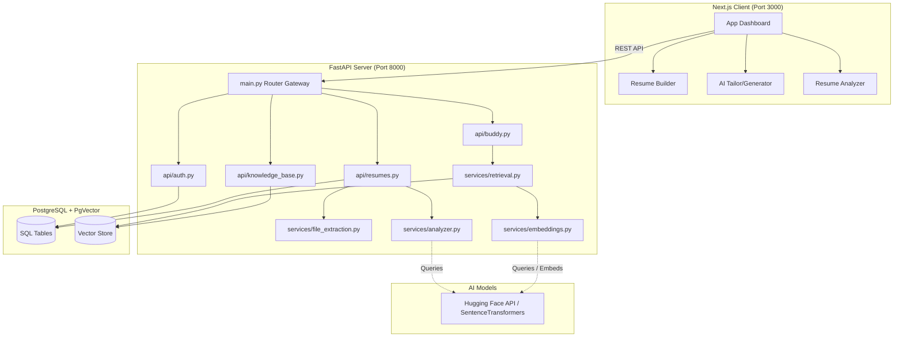

# ResumeBuddy: Architecture & Component Walkthrough

Welcome to the architectural overview of **ResumeBuddy** (also referenced as **ResumeX**). This document breaks down the entire codebase section-by-section, showing exactly how requests flow, where databases connect, how models rank matches, and how the interactive frontend interfaces are structured.

---

## 1. High-Level System Architecture

ResumeBuddy is a multi-tier web application built using **FastAPI** (Python) for the backend and **Next.js** (TypeScript/React App Router) for the frontend.



---

## 2. Backend Breakdown (FastAPI)

The backend code is organized inside `backend/app/` according to standard FastAPI clean architecture.

### A. Initialization & Setup
*   **[main.py](file:///Users/abhishekpaswan/Abhi/Projects/ResumeBuddy/backend/main.py)**:
    The entry point of the server. Instantiates the FastAPI application, configures CORS middleware (allowing cross-origin requests from the React client on port 3000), and registers API endpoint routers under prefixes `/auth`, `/resumes`, `/kb`, and `/buddy`.
*   **[database.py](file:///Users/abhishekpaswan/Abhi/Projects/ResumeBuddy/backend/app/database.py)**:
    Configures SQLAlchemy. Establishes the engine connection pool to PostgreSQL, creates session makers (`SessionLocal`), and defines the declarative base (`Base`) from which all SQLAlchemy database tables inherit.
*   **[config.py](file:///Users/abhishekpaswan/Abhi/Projects/ResumeBuddy/backend/app/config.py)**:
    Manages configuration variables such as the PostgreSQL connection string, JWT secrets, and Hugging Face API tokens by reading them from system environments or the `.env` file.
*   **[dependencies.py](file:///Users/abhishekpaswan/Abhi/Projects/ResumeBuddy/backend/app/dependencies.py)**:
    Houses FastAPI dependencies, primarily:
    *   `get_db()`: Yields active database sessions and ensures they are safely closed after a request finishes.
    *   `get_current_user_id()`: Validates incoming HTTP Bearer tokens (JWT) or cookies, decodes the user ID payload, and injects the authenticated user ID into active routes.

### B. Database Models (`app/models/`)
*   **[user.py](file:///Users/abhishekpaswan/Abhi/Projects/ResumeBuddy/backend/app/models/user.py)**:
    Defines the `User` table (`id`, `email`, `name`, `hashed_password`, `created_at`) representing candidate accounts.
*   **[resume.py](file:///Users/abhishekpaswan/Abhi/Projects/ResumeBuddy/backend/app/models/resume.py)**:
    Defines the `Resume` table (`id`, `user_id`, `title`, `template`, `content`, `created_at`, `updated_at`). The `content` JSON column holds structured resume sections and layout state.
*   **[knowledge_base.py](file:///Users/abhishekpaswan/Abhi/Projects/ResumeBuddy/backend/app/models/knowledge_base.py)**:
    Defines schemas for RAG Knowledge Base sections (`KBPersonal`, `KBEducation`, `KBProject`, `KBExperience`, `KBSkill`, `KBCertification`, `KBAchievement`). Uses **pgvector** (`Vector(384)`) columns to store 384-dimensional dense embeddings alongside entries.

### C. API Endpoints (`app/api/`)
*   **[auth.py](file:///Users/abhishekpaswan/Abhi/Projects/ResumeBuddy/backend/app/api/auth.py)**:
    Responsible for candidate authentication:
    *   `POST /auth/register`: Hashes passwords using `bcrypt` and stores user records in the database.
    *   `POST /auth/login`: Validates credentials, signs JWT access tokens, and sets cookie/bearer response payloads.
    *   `POST /auth/google`: Authenticates OAuth access tokens with Google APIs to sign in or register users.
*   **[resumes.py](file:///Users/abhishekpaswan/Abhi/Projects/ResumeBuddy/backend/app/api/resumes.py)**:
    Handles resume document CRUD and document auditing:
    *   `GET /resumes/`: Lists all resumes created by the authenticated user.
    *   `POST /resumes/`: Creates a new resume document with title, template, and content.
    *   `GET /resumes/{id}`: Retrieves a specific resume version.
    *   `PUT /resumes/{id}`: Updates structured content, section ordering, or selected template.
    *   `DELETE /resumes/{id}`: Removes a resume document.
    *   `POST /resumes/analyze`: Receives an uploaded resume file (PDF/DOCX) and optional Job Description. Extracts text, runs local/AI ATS scoring audits, and returns the analysis report.
*   **[buddy.py](file:///Users/abhishekpaswan/Abhi/Projects/ResumeBuddy/backend/app/api/buddy.py)**:
    Core engine for Knowledge Base status and tailored resume generation:
    *   `GET /buddy/status`: Checks if candidate Knowledge Base has required minimum entries.
    *   `POST /buddy/extract-jd`: Extracts job description text from uploaded files.
    *   `POST /buddy/generate`: Accepts a job description, uses RAG retrieval and ranking to select top-matching entries, and assembles a tailored resume layout.
*   **[knowledge_base.py](file:///Users/abhishekpaswan/Abhi/Projects/ResumeBuddy/backend/app/api/knowledge_base.py)**:
    Exposes CRUD endpoints under `/kb` to manage candidate personal info, education, experience, projects, skills, certifications, and achievements while computing vector embeddings.

### D. Business Logic Services (`app/services/`)
*   **[file_extraction.py](file:///Users/abhishekpaswan/Abhi/Projects/ResumeBuddy/backend/app/services/file_extraction.py)**:
    Handles text parsing:
    *   For **PDFs**, uses `PyMuPDF` (`fitz`) to iterate through pages and extract characters.
    *   For **DOCX** files, uses `python-docx` to read paragraphs.
*   **[analyzer.py](file:///Users/abhishekpaswan/Abhi/Projects/ResumeBuddy/backend/app/services/analyzer.py)**:
    Analyzes formatting, structure, and text quality:
    *   *Section Detection*: Matches headers against case-insensitive regex lists to verify standard sections exist.
    *   *Spelling & Grammar*: Checks words against a local dictionary of common typos (`COMMON_TYPOS`), returning context snippets.
    *   *Bullet Audits*: Traces body text, skipping structural areas (Education, Skills, Certifications) via `remove_sections()`. Audits remaining bullets for metrics, past-tense action verbs, and impact connectors.
    *   *Duplication Checker*: Triggers alerts if action verbs are repeated multiple times.
    *   *Keyword Intersection*: Calibrates keyword match scores by intersecting job description tokens with resume text.
    *   *Readability Formula*: Approximates syllables to compute Flesch Reading Ease rating.
*   **[embeddings.py](file:///Users/abhishekpaswan/Abhi/Projects/ResumeBuddy/backend/app/services/embeddings.py)**:
    Uses Hugging Face feature extraction API or local `SentenceTransformer('all-MiniLM-L6-v2')` to convert text strings into 384-dimensional dense vector embeddings.
*   **[retrieval.py](file:///Users/abhishekpaswan/Abhi/Projects/ResumeBuddy/backend/app/services/retrieval.py)**:
    Performs hybrid retrieval and ranking:
    *   Calculates vector cosine similarity between job description embeddings and stored item embeddings.
    *   Computes BM25 text match scores (`rank_bm25`).
    *   Applies technology keyword boost rules to compute a final relevance score for ranking projects, experience, skills, certifications, and achievements.

---

## 3. Frontend Breakdown (Next.js)

Built using **Next.js** (App Router with React and TypeScript), the client codebase leverages React hooks and Tailwind CSS for responsive visuals.

### A. Pages & Routing (`frontend/src/app/`)
*   **[page.tsx](file:///Users/abhishekpaswan/Abhi/Projects/ResumeBuddy/frontend/src/app/page.tsx)** (Landing Page):
    The entry landing page. Provides standard hero typography, animated feature components, and links directing candidates to log in or enter the dashboard.
*   **[dashboard/page.tsx](file:///Users/abhishekpaswan/Abhi/Projects/ResumeBuddy/frontend/src/app/dashboard/page.tsx)** (Main Hub):
    Acts as navigation central featuring a 3-card layout that splits product workflows:
    *   **Resume Builder** (Blue theme)
    *   **Tailored Generator** (Green theme)
    *   **Resume Analyzer** (Purple theme)
*   **[analyzer/page.tsx](file:///Users/abhishekpaswan/Abhi/Projects/ResumeBuddy/frontend/src/app/analyzer/page.tsx)** (ATS Analyzer Dashboard):
    Interactive ATS audit interface:
    *   *Circular Progress Ring*: Uses SVG stroke-dasharray properties to animate ATS score indicators.
    *   *File Upload Container*: Drag-and-drop target sending files via `FormData` to `/resumes/analyze`.
    *   *Score Breakdown List*: Displays progress bars for Structure, Language Quality, Impact, and Contact Quality.
    *   *Missing Keywords Checklist*: Renders missing skills dynamically as card checklists complete with category badges and copy-paste placement tips.
    *   *Action Verb Bank*: Interactive tags that copy to clipboard on click.
*   **[builder/[id]/page.tsx](file:///Users/abhishekpaswan/Abhi/Projects/ResumeBuddy/frontend/src/app/builder/%5Bid%5D/page.tsx)** (Resume Builder):
    A drag-and-drop section reordering interface powered by `@dnd-kit`, complete with section form editors, real-time template switching, and print-to-PDF compilation.

---

## 4. Key End-to-End Data Flows

### Data Flow A: Resume Upload & Analysis
```
1. Next.js (analyzer/page.tsx) captures file -> Appends to FormData -> Calls POST /resumes/analyze
2. FastAPI (resumes.py) receives request -> Calls file_extraction.py
3. PyMuPDF/docx extracts raw text string -> Passes text to analyzer.py
4. analyzer.py runs audits:
   - Removes Education, Skills, and Certifications sections for bullet analysis
   - Matches remaining bullets against verb lists and metric regexes
   - Computes Flesch Reading Ease and keyword intersections
   - Generates contextual missing keyword placement tips
5. Endpoint packages data -> Returns JSON AnalysisReport
6. React page receives JSON -> Animates circular charts and populates checklist cards
```

### Data Flow B: RAG Tailoring & Generation
```
1. Next.js (buddy/generate/page.tsx) passes Job Description -> Calls POST /buddy/generate
2. FastAPI (buddy.py) validates KB status -> Calls retrieval.py
3. retrieval.py computes JD embedding via embeddings.py and runs hybrid scoring:
   - Vector Cosine Similarity against stored embeddings
   - BM25 text match scoring
   - Technology keyword boost mapping
4. Selects top-ranked experience, projects, skills, certifications, and achievements
5. Assembles ranked items into structured resume content JSON
6. Returns tailored resume payload + ranking metadata to client
```

---

This modular architecture ensures that file parsing, database storage, hybrid retrieval heuristics, local audits, and responsive visual components remain decoupled, robust, and maintainable.
